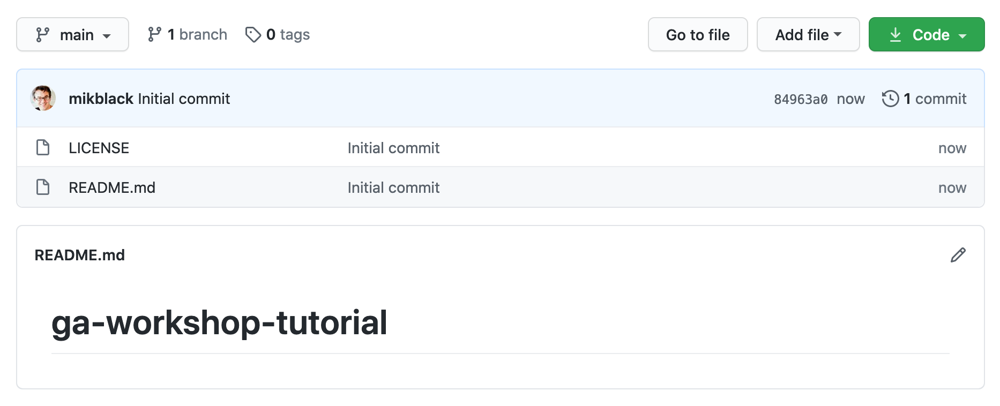

## Workshop creation - getting started

## Creating a GitHub repository

The first step in creating the online workshop material is to set up a GitHub repository for the workshop.

This can be done by visting your GitHub user page, clicking on the "Repositories" tab (left-hand side, near the top), and then on the "New" button (green button, to the right of the window).

Once you've done this, you will be presented with an interface where you provide information about teh new repository. Here is the information that I used to set up the repo for *this* workshop:

Note - I've used the "GNU General Public License v3.0" for this repo.  We can have a discussion about license option if you want...

Also, I've specifed that a README.md file should be generated when the repository is created - we'll edit this in a moment.

Once it has been created (i.e., after you click on the "Create repository" button), you will be taken to the URL (on GitHub) for the new repository.  For the repository for this workshop, it looked like this:

README.md is a markdown file, and is very minimal - it just contains a heading with the name of the repo (in this case "ga-workshop-tutorial"). But clicking on teh "pencil" icon (to the right of the screen), we can edit this file to add some more information. This puts us into an editing mode, where additional text can be added:

Once you save your edits (click the "Commit changes" button below the edit box), the content of the README.md file is rendered and displayed below the repository file list:

### Next steps - moving things to your computer

Although it is possible to develop an entire workshop simply by interfacing with the GitHub website, it is a lot easier to do this work on your own computer, using an editor that has the ability to link to GitHub. 

This allows you to build the workshop content on your own computer, while also benefitting from the backup, version control and collaborative content creation advantages that GitHub provides.

There are a number of good options for editors, but here we have chosen to focus on Visual Studio Code, as it has a resasonably shalow learning curve, and is well supported on Linux, Mac and Windows platforms.

